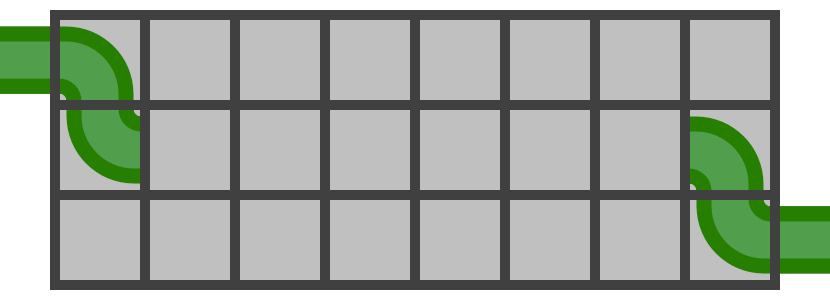
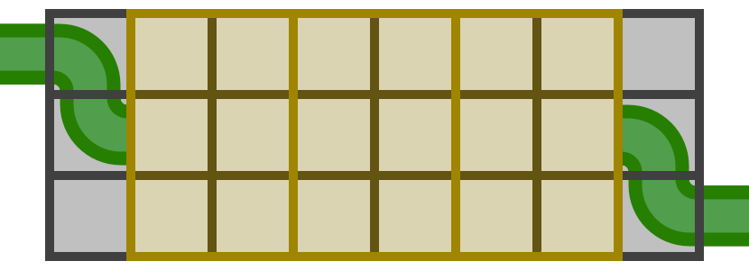
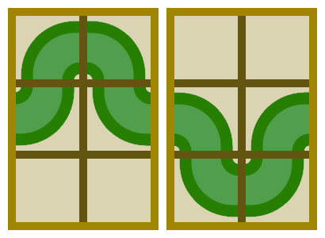

## Let It Flow
Right off the bat, the first two pipes near the top-left corner as well as the last two pipes near the bottom-right corner are forced to be installed as follows:

So, if any of those 4 cells are blocked (or if N = 1), then the answer is 0. Assuming that’s not the case, let’s imagine dividing up the remainder of the grid into two-column segments as follows:

For each of those segments, assuming that water flows in from the left edge of the middle-left cell, there are two possible rotations of pipes which can be installed into that cell, each of which results in no choice regarding the installation of the next three pipes. As such, there are at most two valid sets of pipes which can be installed into each segment, both of which result in water flowing out through the right edge of the middle-right cell:

However, one or both of the above configurations might not actually be valid, depending on which of the segment’s six cells are blocked by walls. Therefore, there will be 0, 1, or 2 valid sets of pipes for each given segment. Each of these sets of pipes have the same result as far as the rest of the grid is concerned, meaning that we can independently compute the number of possibilities for each segment, and multiply all of these counts together to yield the final answer.
Note that, if N is odd, then the grid cannot be divided up into these segments in the first place, resulting in a “half-segment” at the end which cannot connect to the required pair of pipes near the bottom-right corner. Therefore, the answer in this case is 0.
It’s also possible to solve this problem with a dynamic programming approach, for example by computing DP[r][c][d] = {number of ways to allow water to flow into the cell in row r and column c, from direction d (left/up/down)}.

## Ethan Traverses a Tree
Let’s begin by computing the list of node indices X[1..N] which make up the pre-order traversal of the tree, as well as the list of node indices Y[1..N] which make up its post-order traversal. Now, for each index i, we must have L[X[i]] = L[Y[i]], as otherwise the ith label in the pre-order traversal would differ from the ith label in the post-order traversal.
Let’s imagine an undirected graph with N nodes, one for each node in the tree. If we then create N edges, with the ith edge connecting nodes X[i] and Y[i], then a pair of nodes a and b being connected (directly or indirectly) in this graph will correspond to the requirement that L[a] = L[b]. There are no other requirements about which labels must be equal to one another.
As such, we’ll want to divide up the graph into its connected components (in O(N) time using various algorithms, such as breadth-first search). We can then label all nodes in the first component with 1, label all nodes in the second component with 2, and so on. If there are more than K components, then we must stop our labeling at K (for example, by labeling all nodes in the Kth component and onwards with K). If there are fewer than K components, then it’s impossible to achieve the required K distinct labels throughout the tree.

## Platform Parkour
Let Up[i] be the maximum height difference above platform i that platform i+1 must be adjusted to, and Down[i] be the maximum height difference below platform i that platform i+1 must be adjusted to (in other words, such that P[i] - Down[i] ≤ P[i+1] ≤ P[i] + Up[i], where P[i] is the final height of the ith platform). After initializing Up[1..N] and Down[1..N] to Infinity, let’s consider each parkourist i in turn. If they’ll be moving to the left (that is, A[i] > B[i]), we can swap A[i] with B[i] and U[i] with D[i] in order to yield an equivalent parkourist who’ll be moving to the right instead. Then, for each platform j such that A[i] ≤ j < B[i], we can set Up[j] to be at most U[i] and Down[j] to be at most D[i]. This process will aggregate the parkourists’ constraints into a more manageable format for the remainder of our algorithm, and can be completed in as little as O(N + M) time over all parkourists, though a simple O(NM) implementation will suffice given the constraints.
Now, if it’s possible to adjust the platforms in at most x seconds, then it’s also possible in at most y seconds for any y > x, meaning that we can binary search for the answer x in the interval [0, Z] (where Z is the limit on the platforms' heights).
Given a fixed value of x, such that each platform’s height may be adjusted by at most x, we'll need to determine whether or not it’s possible to satisfy all of the platforms’ Up and Down requirements. Let’s iterate over the N platforms from left to right, while maintaining an interval [h₁, h₂] of valid final heights for the current platform. For the first platform, this interval will simply be [H[1] - x, H[1] + x]. Then, when moving from each platform i to i+1, the new interval can be computed as the intersection of a pair of intervals — the previous interval with cross-platform restrictions applied ([h₁ - Down[i], h₂ + Up[i]]), and the next platform’s own interval ([H[i+1] - x, H[i+1] + x]). If the resulting interval ever becomes empty, then the given value of x has proven to be invalid. On the other hand, if we reach the final platform and still have a non-empty interval, then the given value of x is valid. This process of iterating over the platforms takes O(N) time, bringing the overall time complexity of our algorithm up to O(N log(Z) + M).
Evening of the Living Dead
This problem can be solved with a dynamic programming approach, by sweeping through the yards from left to right. We’ll compute the following two arrays of probabilities:
* Let Safe[i][h] be the probability that, after the first i yards, at least one of those yards is still safe, and the tallest fence to the right of the leftmost safe yard has a height of h.
* Let Zombie[i][h] be the probability that, after the first i yards, none of those yards are safe, and the maximum H value of any zombie capable of reaching yard i is h.
Let Z[i] be the maximum H value of any zombie initially in yard i, or 0 if there's no such zombie. If Z[1] = 0, then Safe[1][0] = 1.0, and otherwise, Zombie[1][Z[1]] = 1.0. It’s then possible to compute Safe[i+1][1..10⁶] and Zombie[i+1][1..10⁶] based on Safe[i][1..10⁶] and Zombie[i][1..10⁶] without too much difficulty, though there are a few cases to consider when implementing the transitions, based on the value of Z[i+1] and whether or not it’s less than h.  In short, we’ll need to consider all possible heights which the ith fence could have, and what DP states they would result in. Please see the judge solution for more details.
However, a naive implementation of the approach described above will be far too slow, so a couple of significant optimizations will be required. The first is that we can’t afford to consider all 10⁶ possible heights separately, so we’ll need to instead compress h down to just the set of O(M) unique zombie heights. Our definition of Safe[i][h] will need to be updated slightly as a result, with the the tallest fence to the right of the leftmost same yard now having any height taller than the (h-1)th zombie height but no taller than the hth zombie height. At that point, we’ll have just O(NM) DP states and O(M) transitions per state (considering all possible fence heights relative to zombies).
A time complexity of O(NM²) will still be insufficient. Fortunately, it’s not much more difficult to aggregate together the O(M²) fence-height-based transitions from each yard and process them in an O(M) pass. This optimization improves our time complexity to the required O(NM).
Note that all of the probability values computed throughout the algorithm should be represented as integers (modulo 1,000,000,007) rather than real numbers. Addition, subtraction, and multiplication can be handled trivially, while the results of quotients such as x / y can be computed by multiplying x by the modular multiplicative inverse of y (which can be computed using the extended Euclidean algorithm).